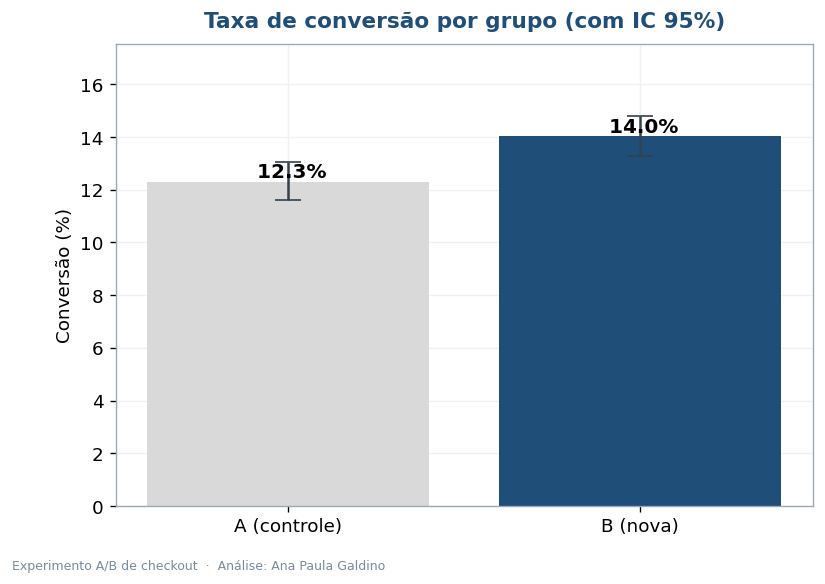
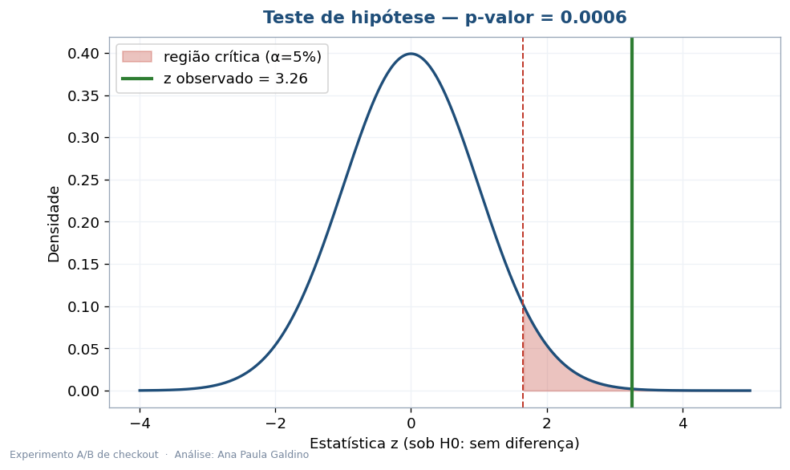
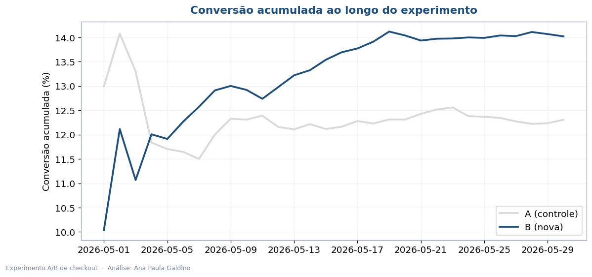
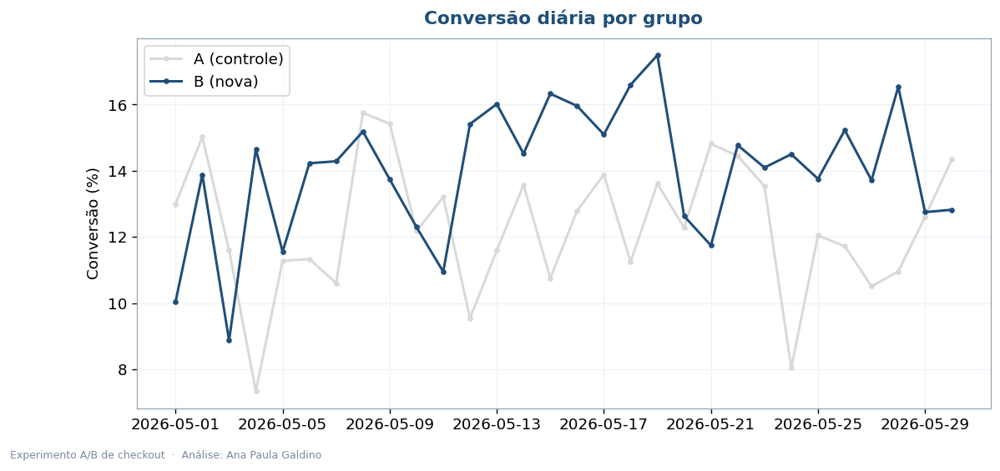
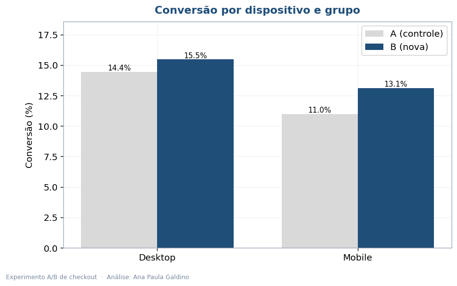
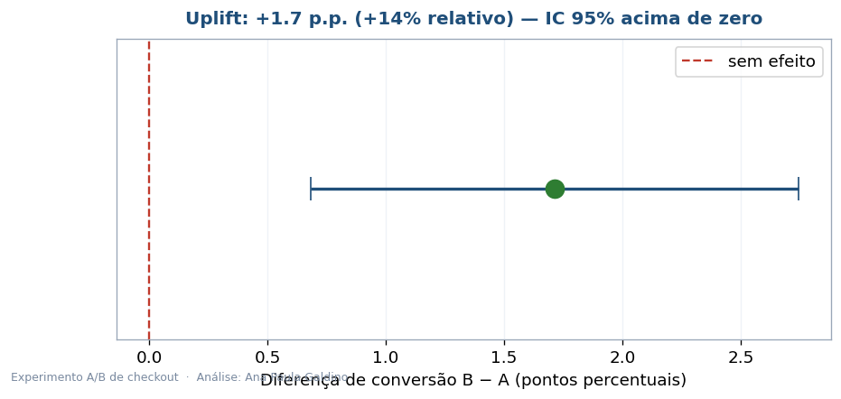

# Teste A/B — A Nova Página Converte Mais?

Toda mudança de produto deveria responder a uma pergunta antes de virar regra: isso realmente
funciona, ou foi sorte? Aqui eu analiso um teste A/B de página de checkout com o rigor que a
decisão merece — taxa de conversão, teste de hipótese, intervalo de confiança e tamanho do efeito.

**[Ler o relatório executivo (PDF)](Analise_Executiva_Teste_AB.pdf)**

## O experimento

- **Grupo A** (controle): página atual
- **Grupo B** (variante): nova versão
- ~16,5 mil visitantes ao longo de 30 dias, divididos entre os grupos
- Métrica: taxa de conversão no checkout

## O veredito

| | |
|---|---|
| Conversão A (controle) | 12,3% |
| Conversão B (nova) | 14,0% |
| Uplift | +1,7 p.p. (**+14%** relativo) |
| p-valor | **0,0006** (significativo) |
| Decisão | implementar a versão B |

Com p-valor de 0,0006, a chance de esse ganho ter vindo do acaso é mínima. A diferença é real,
estável ao longo do tempo e acontece tanto no mobile quanto no desktop.

## As visualizações

| | |
|---|---|
|  |  |
|  |  |
|  |  |

## Tecnologias

Python 3.10+, pandas, scipy e statsmodels (teste de proporções, IC), matplotlib e reportlab.

## Organização

```
teste-ab-conversao/
├── README.md
├── Analise_Executiva_Teste_AB.pdf
├── requirements.txt
├── dados/experimento_ab.csv
├── src/
│   ├── gerar_dados.py     # monta os dados do experimento
│   ├── analise_ab.py      # estatística + os 6 gráficos
│   └── gerar_relatorio.py # monta o PDF
└── imagens/
```

```bash
pip install -r requirements.txt
python src/gerar_dados.py
python src/analise_ab.py
python src/gerar_relatorio.py
```

## Sobre os dados

O experimento (16,5 mil registros) foi simulado por mim com um efeito real embutido, para
demonstrar a metodologia de ponta a ponta. Para analisar um teste real, basta um CSV com
`grupo`, `converteu` e, opcionalmente, `data` e `dispositivo`.

---

Ana Paula Galdino · Data Analytics (POSTECH/FIAP)
[GitHub](https://github.com/AnaPaula-Galdino) · [LinkedIn](https://linkedin.com/in/galdinoana/)
